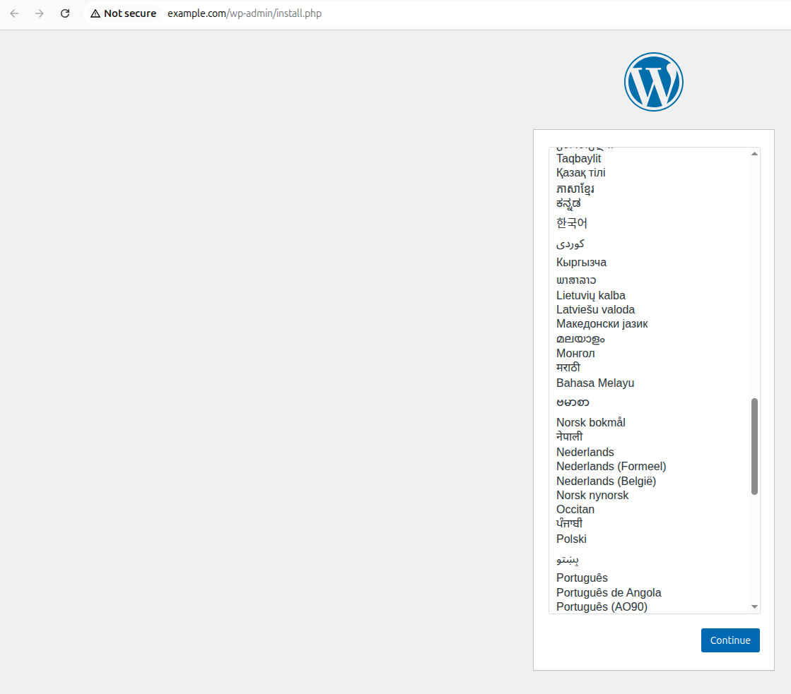
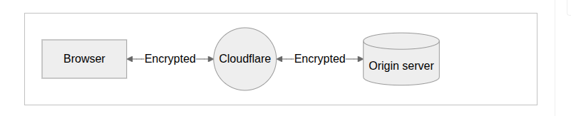

---
```markdown
# Design Document 

This document outlines the technical Design of the following technologies 
##### NOTE ############
All information is checked from the offical page, github sources, CHeck below the links.

---

## Technologies 

| Technology                | Purpose                       | Folder               |
|---------------------------|-------------------------------|----------------------|
| WordPress (Apache2)       | Frontend Application          | ../wordpress-conf    |
| Laravel (Nginx + PHP-FPM) | API/backend logic             | ../laravel-conf      |
| Node.js + PM2             | Background workers or APIs    | ../nodejs-conf       |
| GitHub Actions            | Automation for Laravel        | ../github-pipeline   |
| Nginx (Dockerized)        | Wordpress+Mariadb+ Networking | ../docker            |
| Cloudflare                | HTTPS, caching, security      | ../README.md         |

---


## WordPress on Apache2

# Wordpress-conf
Apache2                                     https://httpd.apache.org/docs/2.4/new_features_2_4.html
apache  conf                                https://httpd.apache.org/docs/2.4/vhosts/examples.html
mod_expires     ExpiresByType Directive:    https://httpd.apache.org/docs/current/mod/mod_expires.html#page-header
mod_deflate     AddOutputFilterByType       https://httpd.apache.org/docs/2.4/mod/mod_deflate.html
Header          RequestHeader               https://httpd.apache.org/docs/2.4/mod/mod_headers.html


---
#### Wordpress on Apache2 #### 
Setup includes on optimized VirtualHost configurations with enhanced security and performances.
## Feature
- # GZIP: 
        Compress via "mod_deflate
- # Browser Cache: 
        Handle by the "mod_expires"
- # Secrty Headers: 
        manage by ( X-Frames, X-XSS-Protections, etc)
- # Directory access restritions:
        into the <Directory> Options
- # Logging Enabled:
        apacehe default directory with path specfied

### SETUP CONFIGURATIONS:
1. Copy the ../wordpress-conf/wordpress.conf to '/etc/apache2/sites-available/wordpress.conf"
            
2. Enable site and modules:

    ```bash
        sudo a2ensite wordpress.conf
        sudo a2enmod rewrite headers expires deflate
        sudo systemctl restart apache2
3. make link "sudo ln -s /etc/apache2/sites-available/wordpress/conf /etc/apache2/sites-enabled/wordpress.conf

### permission management
    sudo chown -R www-data:www-data /var/www/html/wordpress         
                            Note: www-data can be change by the  main apache.conf file as per user.

We can point the domain into domain provider and with this server IP and then by lets encrypt installataion the SSL certificates for this domain can be installed
---

## Laravel on Nginx + PHP-FPM

nginx conf file:
                https://docs.nginx.com/nginx/admin-guide/basic-functionality/managing-configuration-files/
                https://docs.nginx.com/nginx/admin-guide/web-server/web-server/
check for fastcgi by :
            /etc/nginx/fastcgi.conf 
            https://nginx.org/en/docs/http/ngx_http_fastcgi_module.html

check for gzip into: 
            /etc/nginx/fastcgi.conf 
            https://nginx.org/en/docs/http/ngx_http_gzip_module.html

## Feature: 
    Setup for a laravel application running on Nginx with PHP-FPM.

- Nginx:
- PHP 8.1+ with FPM enabled 
            check status by systemctl 
- Laravel project placed into /var/www/laravel
- .env file with configuration with correctt DB credentials and app settings, copy the .env.example to .env and setup all configurations.

### Nginx Configurations:
The ../laravel-conf/laravel.conf copy to the /etc/nginx/sites-available/laravel.conf
 make link "ln -s /etc/nginx/sites-enabled/"
 sudo nginx -t
 sudo systemctl restart nginx // for all configuration else
 sudo systemctl reload nginx

### permission management
    sudo chown -R www-data:www-data /var/www/laravel
    sudo chmod -R 775 /var/www/laravel/storage
    sudo chmod -R 775 /var/www/laravel/bootstraps/cache // something like path   
                            Note: www-data can be change by the  main apache.conf file as per user.

 ## Security

- Access to `.env`, hidden files, and all sensitive paths/data is **strictly denied**
- Essential headers included:
  - X-Frame-Options: SAMEORIGIN
  - X-Content-Type-Options: nosniff
  - X-XSS-Protection: 1; mode=block
  - Strict-Transport-Security` for enforcing HTTPS
- Directory listings are disabled (`autoindex off`)

### Performance

- Gzip compression enabled for fast delivery of HTML, JS, CSS, JSON
- Static assets (images, JS, CSS) are cached for 30 days using the `expires` directive
- Optimized FastCGI buffers to reduce latency for PHP responses # check above link

### Routing

- Requests are routed cleanly through Laravel’s front controller using:
  ```nginx
  try_files $uri $uri/ /index.php?$query_string;

### Laravel NOte 
Most of the content is picked by the Nginx Documentations, conf file might be enhanced with extra secuity and performances modules , with the specfic requirements or demands.
We can also start the [upstream] for deployment perfromace also for production ready app
---

## Node.js Deployment

# Links:

nvm install             https://www.digitalocean.com/community/tutorials/how-to-install-node-js-on-ubuntu-20-04
pm2 ecosystem.config.js https://pm2.keymetrics.io/docs/usage/application-declaration/
nginx conf file:
                        https://docs.nginx.com/nginx/admin-guide/basic-functionality/managing-configuration-files/
                        https://docs.nginx.com/nginx/admin-guide/web-server/web-server/

# Server setup

- Install the node by nvm and use the required node by `nvm use nodexx`
- check the node and npm version
- go to the node.js directory suppose it into /var/www/nodeapp/ ; check the app.js or index.js [ `where you app should run `]
- check the port as well here

#### run pm2 service:

- first copy the ../nodejs-conf/ecosystem.config.js  to specfic path, most commonly copied into parent of project folder 
- setup the project directy permission as well by chown and chmod and user www-data [ as defined into nginx.conf]
- cd /var/www/nodeapp
- pm2 start ecosystem.config.js --env production //  or whatever your enviornment is
- pm2 save
- pm2 startup // follow the printed command to enable at enable at boot


-------------
# Alternative way:
cd /var.www/nodeapp
pm2 start app.js --name nodeapp
pm2 save
pm2 startup 
                        [`pm2 list`]
                        [`pm2 log nodeapp`] // [pm2 log id]
                        [`pm2 restart nodeapp`]
                        [`pm2 monit`]             // interactive CPU/memory Dashboard

# Nginx Setup

copy the file ../nodejs-conf/node.conf to /etc/nginx/sites-available/nginx-node.conf and change the domain etc
sudo ln -s /etc/nginx/sites-available/nginx-node.conf /etc/nginx/sites-enabled/
sudo nginx -t
sudo systemctl reload nginx


---

## Docker Compose Architecture


| Container  | Image                | 
|------------|----------------------|
| wordpress  | `wordpress:latest`   | 
| mariadb    | `mariadb:latest`     | 
| nginx      | `nginx:latest`       |

- Network: `wpnet` Docker bridge
- Volumes: `wp_data`, `db_data`

Helping Links:

Docker:         https://hub.docker.com/_/wordpress 
Github:        https://github.com/mjstealey/wordpress-nginx-docker/blob/master/docker-compose.yml
Github:        https://github.com/kurtcms/docker-compose-wordpress-nginx-mysql/blob/master/docker-compose.yml 
google Search: [`AI Overview`]        https://www.google.com/search?q=workpress+mysql+nginx+docker+compose+docker+offical&sca_esv=4d0ee1113763e3b2&sxsrf=AE3TifPatJRpTLPX4LtgAn4snivDKBxtfw%3A1749815183066&ei=jw9MaODeA_roi-gP-MP1oQ8&ved=0ahUKEwig4qLDqe6NAxV69AIHHfhhPfQQ4dUDCBA&uact=5&oq=workpress+mysql+nginx+docker+compose+docker+offical&gs_lp=Egxnd3Mtd2l6LXNlcnAiM3dvcmtwcmVzcyBteXNxbCBuZ2lueCBkb2NrZXIgY29tcG9zZSBkb2NrZXIgb2ZmaWNhbDIHECEYoAEYCjIHECEYoAEYCjIHECEYoAEYCjIHECEYoAEYCkjwI1D9A1j_IXABeAGQAQCYAZUDoAGgHaoBCTAuMy44LjMuMbgBA8gBAPgBAZgCEKACtx7CAgoQABiwAxjWBBhHwgIGEAAYFhgewgIIEAAYCBgNGB7CAgUQABjvBcICBBAhGBWYAwDiAwUSATEgQIgGAZAGCJIHCTEuMy44LjMuMaAHjVuyBwkwLjMuOC4zLjG4B6AewgcHMC4yLjkuNcgHbw&sclient=gws-wiz-serp 

---

## CI/CD (GitHub Actions)

- Laravel app deployment workflow
- PHP 8.2 setup using `shivammathur/setup-php`
- Composer installation with optimized flags
- Laravel `php artisan test` step

### Helping Links fto write pipeline

[`Complete laravel setup using the php.yaml`]
https://github.com/laravel-workflow/laravel-workflow/blob/master/.github/workflows/php.yml

[`Laravel`] : https://laravel-news.com/laravel-ci-with-github-action

[`Laravel Github`]: https://github.com/laravel/laravel/tree/12.x/.github/workflows


# pipeline
- use the above link for writing the pipeline .
- I have get the complete detail by the github action workflow `Search laravel`, got the laravel.yaml
- Modified it according to project  requirements.
- Added the php and some other installation and with the directory permission.
- We can setup the database as well, I have commented it.

### Setup,
- use  ,github/workflow directory
- copy the laravel.yaml file.
- for real deployment , 
- use the Server Name, IP, SSHkey as github variables.
- set the SSH key as private, further your preferneces.
- Execute it into the testing enviorment first and later change the actual variables
if any error exist, search and debugg and make modify a bit as per requirements.

### Local testing of compose file
- go to the ../docker/ folder 
[`docker compose up --build`]
check logs and get the wordpress link by conf file, 
update the conf server details into [`/etc/hosts`] like [`127.0.0.1 example.com`]
 and  check on the google chromo, word press page will be load like 



---

## Cloudflare Setup

### Links:
**[`SSL Mode`]:https://developers.cloudflare.com/ssl/origin-configuration/ssl-modes/**
**[`Full STrict`]:https://developers.cloudflare.com/ssl/origin-configuration/ssl-modes/full-strict/** 

## Details
- SSL: Full (Strict)
- Nginx listens on HTTP internally
- Cloudflare terminates HTTPS at edge
- Caching policies and DNS routing handled outside




---

## Notes

- WordPress runs fully inside Docker
- Laravel and Node.js run externally (non-containerized) for demo clarity
- CI/CD logic is real and functional
---

End of Design Document.
